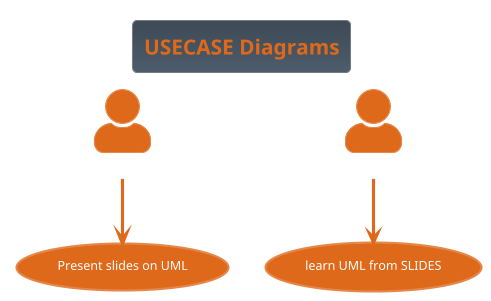

# Room-2

## PlantUML
- We used the tool PlantUML to render UML code to graphical diagrams and flowcharts. 
- If you want PlantUML to render directly from a file on GitHub please install the extension PlantUML viewer to your web browser.
  - Firefox: PlantUML viewer
  - Chrome: Pegmatite
  - Microsoft Edge Markdown Diagrams
- When done you should see the code below as a diagram.

